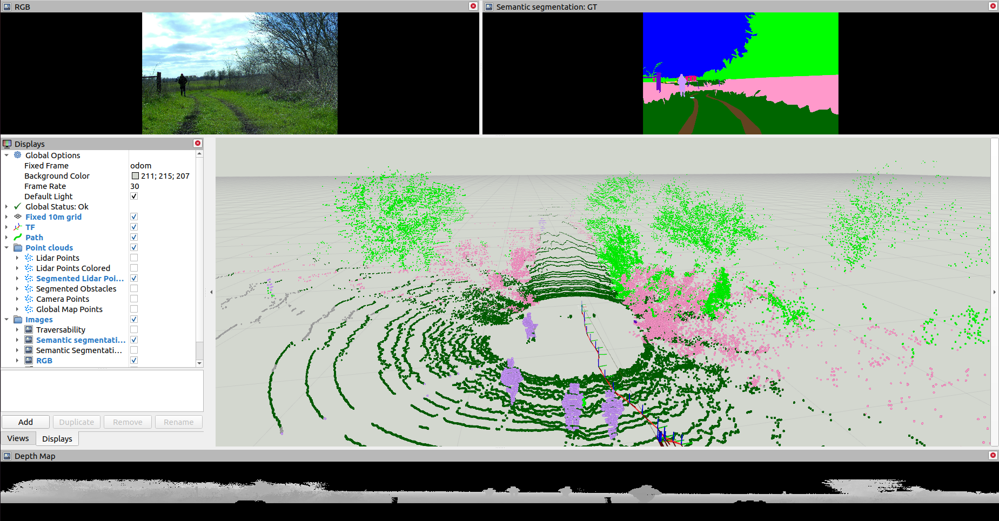

# [Traversability Estimation](https://docs.google.com/document/d/1ZKGbDJ3xky1IdwFRN3pk5FYKq3wiQ5QcbyBPlOGammw/edit?usp=sharing)

Semantic Segmentation of Images and Point Clouds for Traversability Estimation



### Installation (build ROS package)

Prerequisite: install [ROS](http://wiki.ros.org/ROS/Installation)
and build the package in a catkin workspace, for example:

```bash
mkdir -p ~/catkin_ws/src
cd ~/catkin_ws/src
git clone https://github.com/RuslanAgishev/traversability_estimation
cd ~/catkin_ws/
catkin_make
```

Put the [weights](http://subtdata.felk.cvut.cz/robingas/data/traversability_estimation/weights/)
to [./config/weights/](./config/weights/) folder:

```bash
./config/weights/
  ├── hrnetv2_w48_imagenet_pretrained.pth
  ├── seg_hrnet_ocr_w48_train_512x1024_sgd_lr1e-2_wd5e-4_bs_12_epoch484/
  ├── depth_cloud/
  └── smp/
      └── se_resnext50_32x4d_352x640_lr1e-4.pth
```

One may also download datasets to train images and point cloud segmentation models.
Please, refer to [./docs/rellis.md](./docs/rellis.md) or [./docs/trav_data.md](./docs/trav_data.md) for examples.

### Images Semantic Segmentation Node

#### Topics:

- `input_0/rgb, ... input_{num_cameras - 1}/rgb`
- `input_0/camera_info, ... input_{num_cameras - 1}/camera_info`
- `output_0/semseg,... output_{num_cameras - 1}/semseg`
- `output_0/camera_info,... output_{num_cameras - 1}/camera_info`

#### Parameters:

- `num_cameras [int]` - number of image topics for segmentation
- `device [str]` - cpu/cuda
- `legend [bool]` - if legend for segmentation is required
- `image_transport [str]` - 'compressed' or 'raw' if input image topic is compressed

Look at [segmentation_inferece](./scripts/segmentation_inference) for more details.


### Point Cloud Semantic Segmentation Node

#### Topics:

- `cloud_in`: input point cloud to subscribe to (must be of fixed size, `H x W`)
- `cloud_out`: returned segmented point cloud

#### Parameters:

For `flexibility_weights`, `traversability_weights`, and `model_output` please refer to
Traversability Dataset documentation, [./docs/trav_data.md](./docs/trav_data.md)

- `device`: device to run tensor operations on: cpu or cuda
- `max_age`: maximum allowed time delay for point clouds time stamps to be processed
- `range_projection [bool]`: whether to perform point cloud projection to range image inside a node
- `lidar_channels`: number of lidar channels of input point cloud (for instance 32 or 64)
- `lidar_beams`: number of lidar beams of input point cloud (for instance 1024 or 2048)
- `flexibility_weights`: name of torch weights file (*.pth) for points flexibility estimation
- `traversability_weights`: name of torch weights file (*.pth) for points traversability estimation
- `model_output`: one of `traversability` or `flexibility`
- `debug`: whether to publish debug information (for example range image): may slow down the node performance.

Look at [cloud_segmentation](./scripts/cloud_segmentation) for more details.


### Datasets

- For **images** semantic segmentation we provide wrappers for the following datasets:
  
  - [Rellis3DImages](https://unmannedlab.github.io/research/RELLIS-3D)
  - [CWT](https://gamma.umd.edu/researchdirections/autonomousdriving/excavator_tns/)
  - [TraversabilityImages](http://subtdata.felk.cvut.cz/robingas/data/traversability_estimation/TraversabilityDataset/supervised/images/)

- For **point clouds** semantic segmentation we provide wrappers for the following datasets:
  
  - [Rellis3DClouds](https://unmannedlab.github.io/research/RELLIS-3D)
  - [SeamanticKITTI](http://semantic-kitti.org/) and [SemanticUSL](https://unmannedlab.github.io/semanticusl)
  - [TraversabilityClouds](http://subtdata.felk.cvut.cz/robingas/data/traversability_estimation/TraversabilityDataset/supervised/clouds/) and [FlexibilityClouds](http://subtdata.felk.cvut.cz/robingas/data/traversability_estimation/TraversabilityDataset/self_supervised/clouds/)

### Models Training

The following scripts should be run from the [./scripts/tools/](./scripts/tools/) folder:
```commandline
roscd traversability_estimation/scripts/tools/
```

Train point cloud segmentation model to predict traversability labels on SemanticKITTI and SemanticUSL data:

```commandline
python train_depth --datasets SemanticKITTI SemanticUSL --batch_size 4 --output traversability 
```

Train image segmentation model on Rellis3D data:

```commandline
python train_img --dataset Rellis3DImages --batch_size 4 --architecture fcn_resnet50 
```

### Models Evaluation

Evaluate (get IOU score) a point cloud segmentation model trained on TraversabilityClouds data:

```commandline
python eval_depth --dataset TraversabilityClouds --weights /path/to/deeplabv3_resnet101_lr_0.0001_bs_8_epoch_90_TraversabilityClouds_depth_labels_traversability_iou_0.972.pth --output traversability
```

### Demos

- Semantic segmentation of images from RELLIS-3D dataset with HRNet:

    ```bash
    roslaunch traversability_estimation image_segmentation_demo.launch model_name:=hrnet
    ```
  
- Semantic segmentation of point clouds from RELLIS-3D dataset with HRNet:

    ```bash
    roslaunch traversability_estimation cloud_segmentation_dataset_demo.launch
    ```

- Coloring lidar cloud using calibrated cameras and semantic classes:

    
    
    - Clone and build the [point_cloud_color](https://github.com/ctu-vras/point_cloud_color) package.
    - Run demo:
        ```bash
        roslaunch traversability_estimation color_pc_bagfile_demo.launch
        ```
