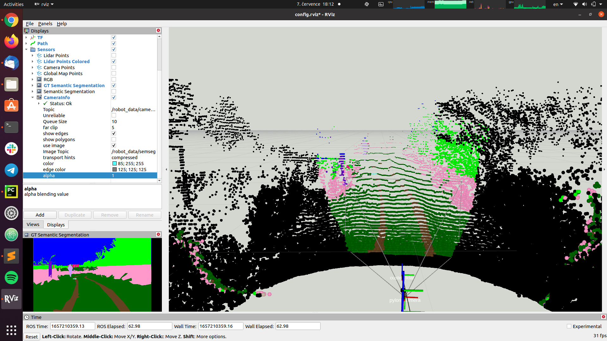

# [Traversability Estimation](https://docs.google.com/document/d/1ZKGbDJ3xky1IdwFRN3pk5FYKq3wiQ5QcbyBPlOGammw/edit?usp=sharing)

Semantic Segmentation of Images for Traversability Estimation

## <a name="rellis3d">RELLIS-3D Dataset</a>

A multimodal dataset collected in an off-road environment containing annotations
for 13,556 LiDAR scans and 6,235 images (semantic segmentation).
Data in ROS bag format, including RGB camera images, LiDAR point clouds, a pair of stereo images,
high-precision GPS measurement, and IMU data.

#### Installation instruction

- Go to the dataset [webpage](https://unmannedlab.github.io/research/RELLIS-3D).
- Download the data to the relative path `./data`.
- Extract the zip files in order to have the following layout on disk:

```bash
    ├─ Rellis_3D
        ├── 00000
        │   ├── os1_cloud_node_color_ply
        │   ├── pylon_camera_node
        │   ├── pylon_camera_node_label_color
        │   └── pylon_camera_node_label_id
        ...
        └── calibration
            ├── 00000
            ...
            └── raw_data
```

See [rellis_3d.py](./src/traversability_estimation/rellis_3d.py) for more details.

### ROS wrapper

Prerequisite: install [ROS](http://wiki.ros.org/ROS/Installation)
and build the package in a catkin workspace, for example:

```bash
mkdir -p ~/catkin_ws/src
cd ~/catkin_ws/src
git clone https://github.com/RuslanAgishev/traversability_estimation
cd ~/catkin_ws/
catkin_make
```

### RELLIS-3D demo

Publish the RELLIS-3D data as ROS messages:

```bash
source ~/catkin_ws/devel/setup.bash
roslaunch traversability_estimation robot_data.launch data_sequence:='00000'
```

### Semantic Segmentation Node

Model: [HRNet](https://github.com/unmannedlab/RELLIS-3D/tree/main/benchmarks/HRNet-Semantic-Segmentation-HRNet-OCR)

Download HRNet
[weights](https://drive.google.com/u/0/uc?id=137Lfw6HcDmdEReu_R7Q_I-zmRvvqFys3&export=download) pretrained on RELLIS-3D
and bakbone [weights](https://onedrive.live.com/?authkey=%21AKvqI6pBZlifgJk&cid=F7FD0B7F26543CEB&id=F7FD0B7F26543CEB%21116&parId=F7FD0B7F26543CEB%21105&action=locate) (pretrained on ImageNet).

Put the weights to `./config/weights` folder:

```bash
./config/weights/
  ├── hrnetv2_w48_imagenet_pretrained.pth
  └── seg_hrnet_ocr_w48_train_512x1024_sgd_lr1e-2_wd5e-4_bs_12_epoch484
      └── models
          ├── ...
```

#### Topics:

- `input_0/rgb, ... input_{num_cameras - 1}/rgb`
- `input_0/camera_info, ... input_{num_cameras - 1}/camera_info`
- `output_0/semseg,... output_{num_cameras - 1}/semseg`
- `output_0/camera_info,... output_{num_cameras - 1}/camera_info`

#### Parameters:

- `num_cameras [int]` - number of image topics for segmentation
- `device [str]` - cpu/cuda
- `legend [bool]` - if legend for segmentation is required
- `image_transport [str]` - 'compressed' or 'raw' if input image topic is compressed

### Demos

- Semantic segmentation of images from RELLIS-3D dataset with HRNet:

    ```bash
    roslaunch traversability_estimation image_segmentation_demo.launch 
    ```

- Coloring lidar cloud using calibrated cameras and semantic classes:

    
    
    - Clone and build the [point_cloud_color](https://github.com/ctu-vras/point_cloud_color) package.
    - Run demo:
        ```bash
        roslaunch traversability_estimation color_point_cloud_demo.launch
        ```
