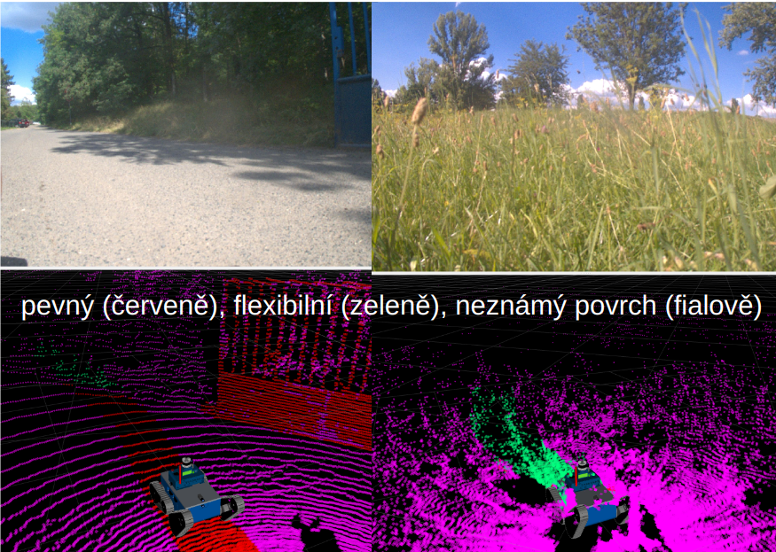

## Traversability dataset

[Traversability Dataset](http://subtdata.felk.cvut.cz/robingas/data/traversability_estimation/TraversabilityDataset/):

- Point clouds (151 data samples) and RGB images (250 data samples) with segmentation labels (traversable, non-traversable area).
Data is labelled manually by human annotator.

Forest environment            |  Town environment
:-------------------------:|:-------------------------: 
 | 


- Point clouds with self-supervised annotations of traversable area from robot's trajectories (10162 data samples).
Data is labelled utilizing robot pose estimation (with the help of LiDAR SLAM).
Automatic data annotation for learning the traversability model in the field (e.g. driving through grass).
Designation of solid terrain under the robot and according to geometry.



Download the data to the path [traversability_estimation/data](../data).

Run the demo to explore data samples (assuming that the package is built):
```bash
python -m datasets.traversability_dataset
```

See [traversability_dataset.py](../src/datasets/traversability_dataset.py) for more details.
