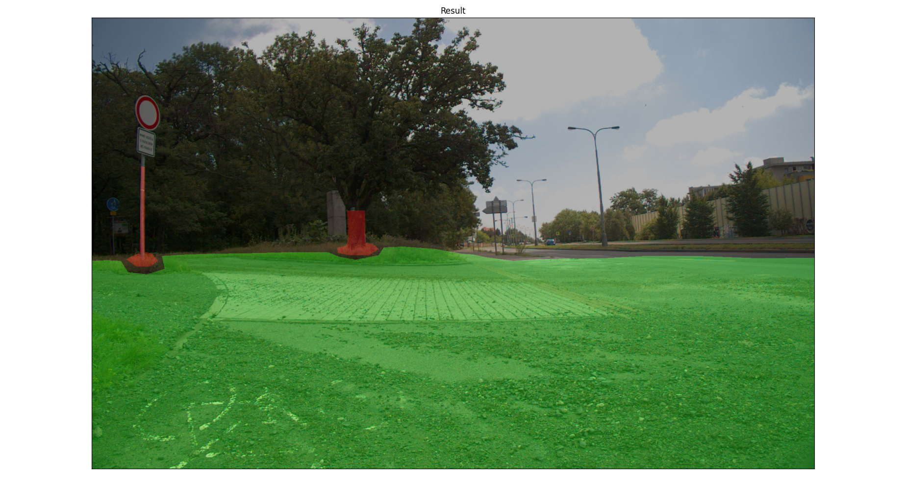
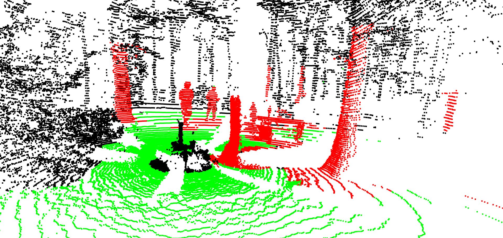

## Traversability dataset

[Traversability Dataset](http://subtdata.felk.cvut.cz/robingas/data/traversability_estimation/TraversabilityDataset/):

- Point clouds and RGB images with segmentation labels (traversable, non-traversable area).

Forest environment            |  Town environment
:-------------------------:|:-------------------------: 
 | 

- Point clouds with self-supervised annotations of traversable area from robot's trajectories.
    
Download the data to the path [traversability_estimation/data](../data).

See [traversability_dataset.py](../src/datasets/traversability_dataset.py) for more details.
